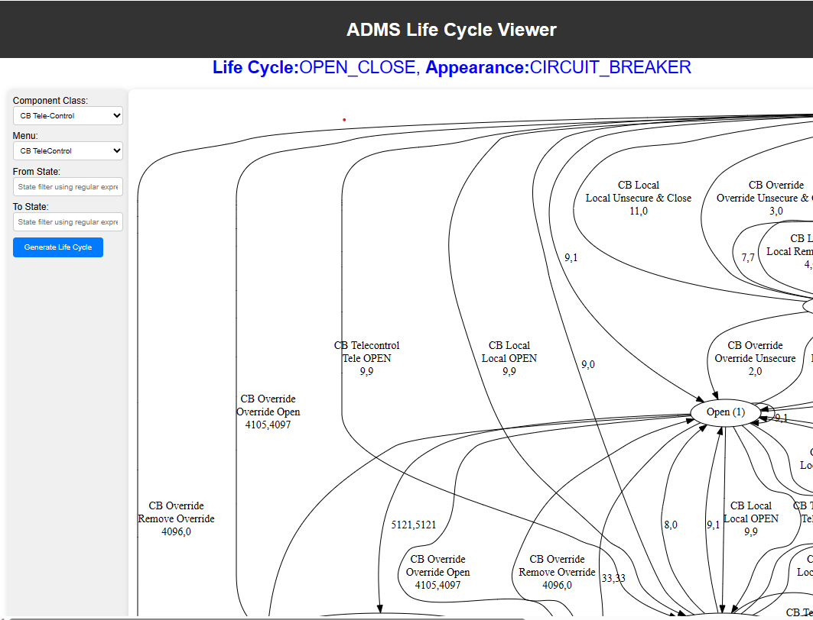

# ADMS Life cycle viewer

ADMS life cycle viewer is a script that can be use as part of apache server that hosting webview for GE ADMS version 5.22SP8 and above to assist with life cycle visualization.

This script assumed graphviz is installed as part of the GE installation core product and therefore does not provide the step for installation of graphviz.

## Installation

Copy the src/lic_viewer.pl into /users/bin/web/webview/start and give the correct permission. For example

```
chmod 755 lic_viewer.pl
```

## Usage

```
http://<webview_server_url>/webview/start/lic_viewer.pl
```

## Sample screenshot

 